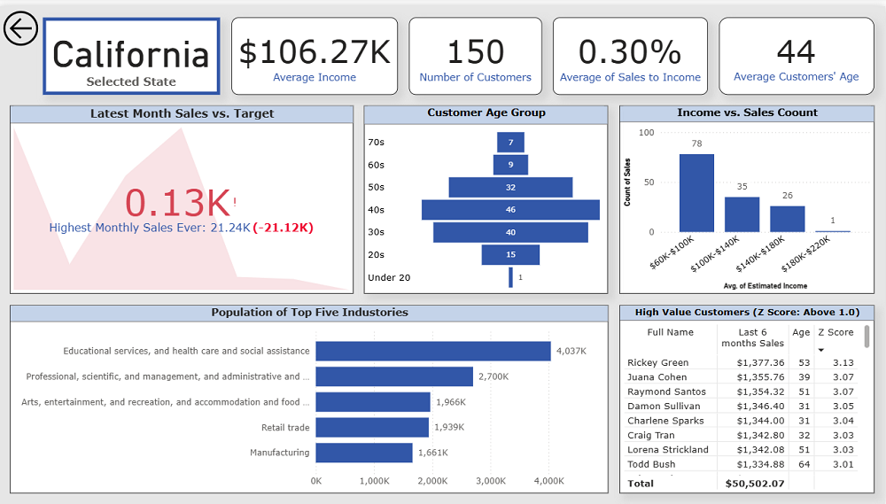

This is the third and final project under Udacity Nanodegree program  
Data Analysis and Visualization with Microsoft Power BI - Course 4: Advanced Data Analysis with Power BI.

----
# Project 3: Market Analysis Report for a National Clothing Chain

## Objective
A national online clothing retailer is experiencing stagnant sales and wants to re-engage past customers through targeted marketing. The company aims to advertise one of three key products — **Shirt ($25)**, **Sweater ($100)**, or **Leather Bag ($1,000)** — but is uncertain which customers to target and with which product. Your task is to build a data-driven Power BI report that helps identify the optimal customer-product-location matches for a new campaign.

---

## Project Overview
This project involves data preparation, advanced DAX calculations, and visual analysis to generate personalized marketing insights. You'll use Power BI to create visuals that highlight customer trends and provide actionable recommendations for the company's marketing team.

---

## Key Deliverables

### 1. Data Preparation with Power Query
- Clean and structure the dataset using Power Query Editor.
- Apply custom M formulas for advanced data shaping where necessary.

### 2. Calculations with DAX
- Create a **calculated column** to generate a histogram of customer data.
- Develop DAX logic for column charts and analytical comparisons between product segments.

### 3. Data Visualization & Analysis
- Build and interpret the following visuals:
  - **Histogram** for customer frequency distribution
  - **Linear regression** chart for forecasting trends
  - **Scatterplot** with correlation coefficient (via card visual)

---

### Analysis Qestions

1. What is the correlation (R2 value) between sales and income?
2. What is the correlation (R2 value) between customer ratings and product return rate?
3. What are the linear regression formulas to predict customer income from customer sales?
4. Which customer do you predict has the highest income?
5. Which product will be advertised the most?

-----

I have created three pages for the report. 

1. Income & Location insights

   

2. Customer Insights

3. Product Insights

4. Summary report

After submission, I have created drill through page to utilize industly data and sales data for more informaiton and to see the clear information .  

5. Drill Through State

