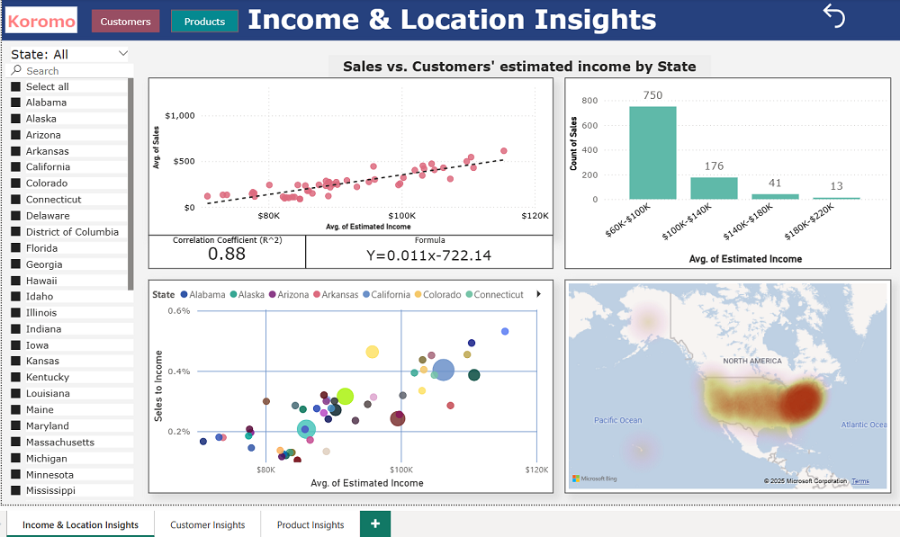

This is the third and final project under Udacity Nanodegree program  
Data Analysis and Visualization with Microsoft Power BI - Course 4: Advanced Data Analysis with Power BI.

----
# Project 3: Market Analysis Report for a National Clothing Chain

## Objective
A national online clothing retailer is experiencing stagnant sales and wants to re-engage past customers through targeted marketing. The company aims to advertise one of three key products — **Shirt ($25)**, **Sweater ($100)**, or **Leather Bag ($1,000)** — but is uncertain which customers to target and with which product. Your task is to build a data-driven Power BI report that helps identify the optimal customer-product-location matches for a new campaign.

---

## Project Overview
This project involves data preparation, advanced DAX calculations, and visual analysis to generate personalized marketing insights. You'll use Power BI to create visuals that highlight customer trends and provide actionable recommendations for the company's marketing team.

---

## Key Tasks

### 1. Data Preparation with Power Query
- Clean and structure the dataset using Power Query Editor.
- Apply custom M formulas for advanced data shaping where necessary.

### 2. Calculations with DAX
- Create a **calculated column** to generate a histogram of customer data.
- Develop DAX logic for column charts and analytical comparisons between product segments.

### 3. Data Visualization & Analysis
- Build and interpret the following visuals:
  - **Histogram** for customer frequency distribution
  - **Linear regression** chart for forecasting trends
  - **Scatterplot** with correlation coefficient (via card visual)

---

### Analysis Qestions

1. What is the correlation (R2 value) between sales and income?
2. What is the correlation (R2 value) between customer ratings and product return rate?
3. What are the linear regression formulas to predict customer income from customer sales?
4. Which customer do you predict has the highest income?
5. Which product will be advertised the most?

-----

### Dashboard Preview

I have created three pages for the report. 

🟠 Income & Location insights

* There was no customer income data provided, and estimating it was one of the project tasks. I used linear regression based on customer purchase data and average state income data from the U.S. Census Bureau to make the estimates.
  
🟣 Customer Insights

* I added calculated columns for outliers and Z-scores to use for the visualizations.

🔵 Product Insights

---------
🔴 Summary report
[Page1](Screenshots/5-Summary-report-P.1.png), [Page2](Screenshots/6-Summary-report-P.2.png)
--------

## Additional Drill-through page
After submission, I created a drill-through page to leverage industry and sales data, providing more detailed and transparent insights for each state. To build the KPI visualization, I first grouped the sales data into daily summaries by state. Then, I merged the queries and created one DAX measure to show the latest Monthly sales for each state, and another to caluculate each state's highest-ever Monthly sales, which I used as a sales target. 

🟤 Drill Through State

